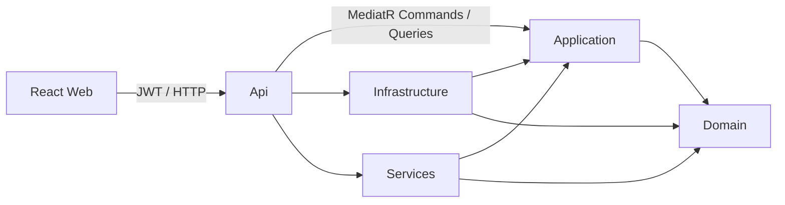
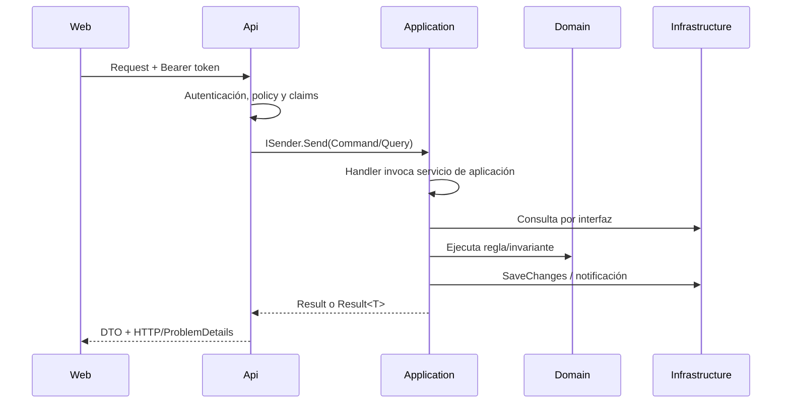

# Arquitectura

## Dependency Rule



- **Domain:** entidades, enums, invariantes y matriz de estados; no referencia frameworks.
- **Application:** casos de uso, DTOs, Result Pattern y puertos de persistencia/seguridad/notificación.
- **Infrastructure:** EF Core, SQL Server, migrations, consultas proyectadas, seeds y repositorio JSON.
- **Services:** hashing, emisión JWT y adaptador de notificaciones por logging.
- **API:** controllers, autorización, Problem Details, Swagger, CORS, Serilog y composition root.
- **Web:** rutas protegidas, formularios, vistas y cliente HTTP; nunca decide la autorización real.

## Flujo de una petición



## Modelo relacional

- `Usuario 1:N Solicitud` como solicitante y `Usuario 0..1:N Solicitud` como responsable.
- `Area 1:N Solicitud` y `TipoSolicitud 1:N Solicitud` con borrado restringido.
- `Solicitud 1:N HistorialEstado`, `HistorialAsignacion`, `ActividadSolicitud`, `Comentario` y `Notificacion` con borrado en cascada de dependientes.
- Usuarios vinculados a auditoría/notificaciones usan borrado restringido.
- `Solicitud.Codigo` y `Usuario.Correo` son únicos; catálogos tienen nombre único.
- `Solicitud.RowVersion` aplica concurrencia optimista.
- Índices cubren estado, prioridad, área, solicitante, responsable, fecha y búsquedas de historiales/notificaciones.

El código `SOL-{año}-{secuencia}` usa una secuencia SQL, evitando el antipatrón `COUNT(*) + 1` y colisiones concurrentes.

## Consultas y seguridad

Los listados mantienen `IQueryable` hasta `CountAsync`/`ToListAsync`, usan `AsNoTracking`, proyección, filtros, ordenamiento y paginación en SQL. El detalle proyecta DTOs y excluye comentarios internos para solicitantes. Un solicitante recibe 404 al intentar consultar un recurso ajeno, evitando confirmar su existencia.

JWT contiene identificador y rol. Controllers exigen autenticación; las policies limitan administración/gestión y Application vuelve a aplicar reglas por recurso usando claims, no IDs enviados por el cliente.

## CQRS con MediatR

Los controllers dependen únicamente de `ISender`. Las lecturas se representan como Queries y las mutaciones como Commands; cada mensaje tiene un `IRequestHandler` en Application. El handler recibe los datos de entrada y el `CurrentUser` obtenido desde los claims, e invoca el servicio de aplicación correspondiente.

```text
Controller → ISender → Command/Query Handler → Application Service → Domain/Ports
```

MediatR coordina el despacho en proceso; no sustituye las reglas de negocio ni los servicios. Los servicios existentes continúan concentrando los casos de uso y pueden migrarse gradualmente a handlers más específicos sin afectar el contrato HTTP.

El auto-registro público crea exclusivamente usuarios `Solicitante`; el servidor no acepta un rol elegido por el cliente. La administración de usuarios exige la policy `Administration`, valida correo único y contraseña, y conserva usuarios inactivos para no romper la trazabilidad histórica. Un administrador no puede desactivar su propia cuenta ni retirarse su propio rol.

## Persistencia y notificaciones

`ApplicationDbContext` es el Unit of Work técnico. La API aplica migrations y luego un inicializador idempotente crea usuarios, catálogos y solicitudes demo. EF migrations son la única definición del esquema.

Las entidades gubernamentales permanecen separadas en JSON porque el requerimiento exige texto plano dentro del proyecto. El repositorio valida que la ruta quede bajo el content root y usa exclusión mutua más reemplazo atómico.

Las operaciones de solicitud crean una `Notificacion` relacional y llaman a `INotificationDispatcher`. El adaptador actual registra un evento estructurado; email, RabbitMQ o Azure Service Bus pueden sustituirlo sin cambiar Domain ni los casos de uso.

## Solicitud como elemento de trabajo

`/solicitudes/{id}` es la única pantalla de gestión. Estado, responsable, prioridad, área, tipo y fecha compromiso se actualizan mediante endpoints `PATCH` específicos. La API devuelve el detalle actualizado y React lo usa como fuente de verdad.

La asignación es nullable e independiente del estado y de la autorización. Administrador y Analista pueden asignar cualquier usuario activo; un Solicitante asignado no obtiene permisos de gestión. Los cambios de estado y campos operativos usan `RowVersion`; un valor obsoleto produce HTTP 409. La asignación se procesa sobre la versión actual para permitir que una reasignación sea compatible con un cambio concurrente de otro campo.

La actividad funcional se compone de cambios de campos, historial de estado, historial de asignación y comentarios. Los comentarios internos se filtran en SQL antes de construir el feed para un Solicitante.

No se agregaron domain events: para este alcance, persistir y despachar mediante un puerto explícito mantiene el desacoplamiento con menor complejidad. Un outbox sería el siguiente paso si se incorporara mensajería externa con entrega garantizada.
