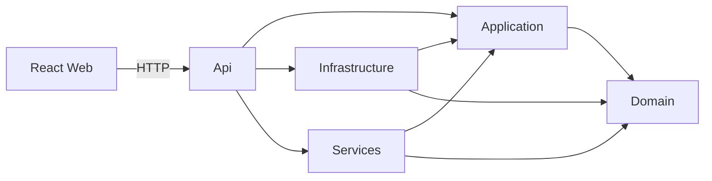

# Arquitectura

## Capas

La solución sigue Onion Architecture y aplica la regla de dependencias hacia el
núcleo:

- **Domain:** reglas e invariantes del negocio; no depende de frameworks.
- **Application:** casos de uso, contratos y DTOs; depende únicamente de Domain.
- **Infrastructure:** EF Core, SQL Server, repositorios y persistencia en archivos.
- **Services:** adaptadores técnicos como JWT y canales de notificación.
- **API:** presentación y composition root.

## Estado del scaffold

Los proyectos y sus referencias están creados, pero las carpetas funcionales no
contienen todavía código productivo. La API registra los puntos de extensión de las
capas y publica únicamente `GET /health`.

## Persistencia prevista

La plataforma principal usará SQL Server mediante EF Core. El mantenimiento de
entidades gubernamentales tendrá una abstracción propia y una implementación basada
en archivo JSON, manteniendo Application independiente del formato físico.

EF Core será la única fuente del esquema relacional. Las migrations se generarán en
desarrollo a partir de las entidades y configuraciones de Infrastructure; la API
aplicará las migrations pendientes durante su arranque con `Database.MigrateAsync`.
Los seeds relacionales se ejecutarán después mediante un inicializador idempotente.
